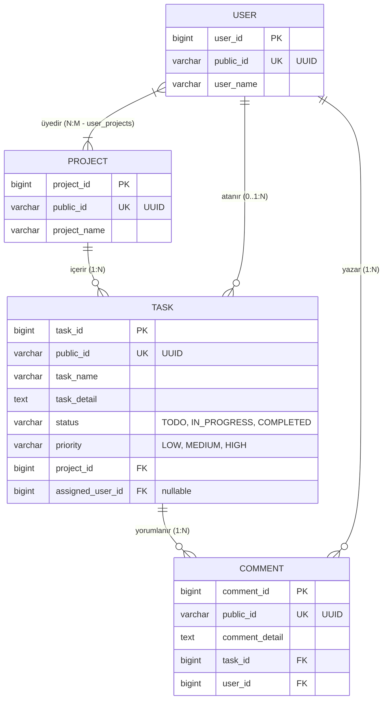
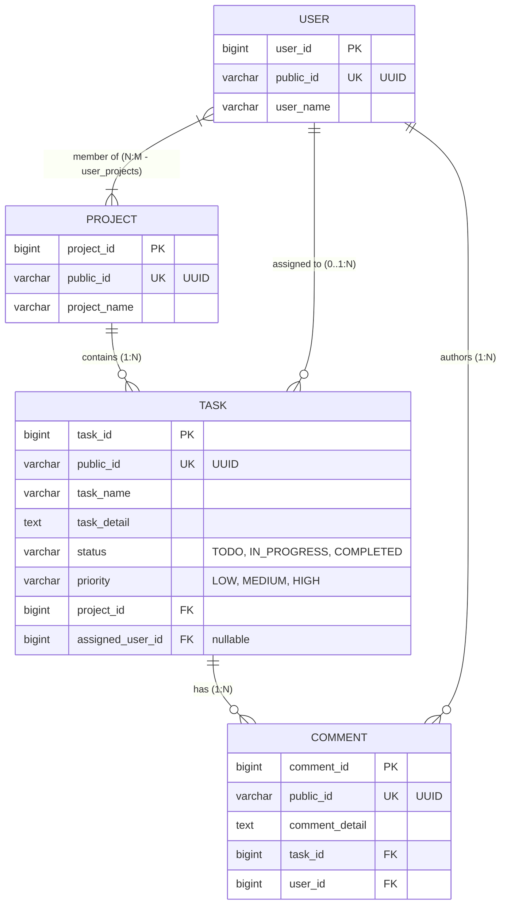

<span id="top"></span>
<div align="center">

# 📋 Görev Takip Sistemi | Task Tracking System

[](https://www.oracle.com/java/)
[](https://spring.io/projects/spring-boot)
[](https://www.mysql.com/)
[](https://www.docker.com/)
[](https://www.sonarqube.org/)
[](https://www.jacoco.org/)

<br />

<p align="center">
  <sub>🌐 <b>Dil / Language:</b> &nbsp; <a href="#tr">🇹🇷 Türkçe</a> &nbsp;•&nbsp; <a href="#en">🇬🇧 English</a></sub>
</p>

---
</div>

<br />

<span id="tr"></span>
### 🇹🇷 Türkçe

Modern, ölçeklenebilir ve kurumsal mimari pratiklerine uygun olarak geliştirilmiş **RESTful Görev & Proje Yönetim Sistemi** arka yüz (backend) uygulaması.

## 🎯 Projenin Ana Fikri ve Vizyonu

Bu proje; ekiplerin projeler oluşturmasını, kullanıcıları projelere dahil etmesini, Kanban metodolojisine uygun görevler tanımlayıp yönetmesini ve görevler üzerinde tartışabilmesini sağlayan bir iş yönetim platformunun arka yüz çekirdeğidir.

### 🛡️ Temel Tasarım İlkeleri
- **Doğal Anahtar Soyutlaması (Public UUID Pattern):** Veritabanı içindeki ardışık birincil anahtarlar (`id - Long`) dış dünyaya **asla sızdırılmaz**. Tüm REST haberleşmesi güvenli, tahmin edilemez `publicId` (UUID v4) üzerinden yürütülür.
- **Güçlü Veri Bütünlüğü ve İş Kuralları:** Bir göreve atanacak kullanıcının **mutlaka o projenin üyesi olması** gibi kritik iş kuralları servis katmanında sıkı bir şekilde denetlenir.
- **Değişmezlik (Immutability):** DTO katmanında Java `record` tipleri kullanılarak veri transfer nesnelerinin güvenliği ve değişmezliği garanti altına alınmıştır.
- **Clean Architecture & Clean Code:** SonarQube kalite kurallarına ve katmanlı mimari prensiplerine tam uyum.

---

## 🚀 Öne Çıkan Yetenekler

- 📁 **Proje Yönetimi:** Proje oluşturma, tüm projeleri listeleme ve UUID üzerinden detay sorgulama.
- 👥 **Kullanıcı & Üyelik Sistemi:** Kullanıcı tanımlama, kullanıcıları projelere atama (Many-to-Many) ve bir projenin üyelerini sorgulama.
- 📌 **Görev Yaşam Döngüsü (Task Lifecycle):**
  - Görev oluşturma, detaylandırma, önceliklendirme (`LOW`, `MEDIUM`, `HIGH`).
  - Kanban durum geçişleri (`TODO` ➔ `IN_PROGRESS` ➔ `COMPLETED`).
  - Projeye veya atanan kullanıcıya göre görevleri filtreleme.
  - Göreve yetkili kullanıcı atama.
- 💬 **Yorum & Tartışma Sistemi:** Görevler altına kullanıcı bazlı anlık yorum ekleme ve yorum akışını listeleme.
- ⏱️ **HTTP Metrik & İstek Günlüğü:** Özel `RequestLoggingFilter` ile gelen her HTTP isteğinin metodu, yolu, yanıt statüsü ve milisaniye cinsinden işlem süresi anlık loglanır.

---

## 🏗️ Katmanlı Mimari Yapısı

```text
com.ismailcolak.gorev_takip_sistemi/
├── config/              # CORS ve Filter konfigürasyonları
├── controllers/         # REST API uç noktaları (HTTP istek/yanıt yönetimi)
├── dto/
│   ├── request/         # İstemciden gelen veri modelleri (Jakarta Validation anotasyonlu Record'lar)
│   └── response/        # İstemciye dönen saf veri modelleri (Record'lar)
├── entities/            # JPA Veritabanı varlıkları ve Enum'lar
├── exceptions/          # Merkezi hata yakalama mekanizması (@RestControllerAdvice)
├── filters/             # HTTP İstek/Yanıt loglama filtreleri
├── repositories/        # Spring Data JPA veri erişim arayüzleri
└── services/            # İş mantığı, validasyonlar ve transaction yönetimi
```

---

## 🗄️ Veritabanı Modeli ve İlişkiler (ERD)



---

## 📡 REST API Endpoint Dokümantasyonu

Tüm istek ve yanıtlar `application/json` formatındadır.

### 1. Projeler (`/api/projects`)

| Metot | Endpoint | Açıklama | Başarılı Durum |
| :--- | :--- | :--- | :--- |
| `POST` | `/api/projects` | Yeni proje oluşturur | `201 Created` |
| `GET` | `/api/projects` | Tüm projeleri listeler | `200 OK` |
| `GET` | `/api/projects/{publicId}` | Belirtilen projenin detayını getirir | `200 OK` |

#### Örnek İstek Gövdesi (`POST /api/projects`):
```json
{
  "projectName": "E-Ticaret Mikroservis Dönüşümü"
}
```

---

### 2. Kullanıcılar (`/api/users`)

| Metot | Endpoint | Açıklama | Başarılı Durum |
| :--- | :--- | :--- | :--- |
| `POST` | `/api/users` | Yeni kullanıcı kaydeder | `201 Created` |
| `GET` | `/api/users` | Tüm kullanıcıları listeler | `200 OK` |
| `GET` | `/api/users/{publicId}` | Kullanıcı detayını getirir | `200 OK` |
| `POST` | `/api/users/{userPublicId}/projects/{projectPublicId}` | Kullanıcıyı bir projeye üye yapar | `200 OK` |
| `GET` | `/api/users/by-project/{projectPublicId}` | Belirli bir projedeki tüm kullanıcıları listeler | `200 OK` |

#### Örnek İstek Gövdesi (`POST /api/users`):
```json
{
  "userName": "ismailcolak"
}
```

---

### 3. Görevler (`/api/tasks`)

| Metot | Endpoint | Açıklama | Başarılı Durum |
| :--- | :--- | :--- | :--- |
| `POST` | `/api/tasks` | Yeni görev tanımlar | `201 Created` |
| `GET` | `/api/tasks/{publicId}` | Görev detayını getirir | `200 OK` |
| `GET` | `/api/tasks/by-project/{projectPublicId}` | Bir projeye ait görevleri getirir | `200 OK` |
| `GET` | `/api/tasks/by-user/{userPublicId}` | Bir kullanıcıya atanmış görevleri getirir | `200 OK` |
| `PATCH`| `/api/tasks/{taskPublicId}/status` | Görev durumunu günceller | `200 OK` |
| `PUT`  | `/api/tasks/{taskPublicId}/assign/{userPublicId}` | Göreve kullanıcı atar | `200 OK` |

#### Örnek İstek Gövdesi (`POST /api/tasks`):
```json
{
  "taskName": "Ödeme Servisi Entegrasyonu",
  "taskDetail": "Iyzico / Stripe webhook entegrasyonu tamamlanacak.",
  "priority": "HIGH",
  "projectPublicId": "58e1eb6a-8b89-42b7-8a39-fb1d668fc79e",
  "assignedUserPublicId": "9d1bf762-23c3-4d40-bfae-22da56291a10"
}
```

#### Durum Güncelleme (`PATCH /api/tasks/{id}/status`):
```json
{
  "status": "IN_PROGRESS"
}
```
*(Kabul edilen değerler: `TODO`, `IN_PROGRESS`, `COMPLETED`)*

---

### 4. Yorumlar (`/api/tasks/{taskPublicId}/comments`)

| Metot | Endpoint | Açıklama | Başarılı Durum |
| :--- | :--- | :--- | :--- |
| `POST` | `/api/tasks/{taskPublicId}/comments` | Göreve yeni yorum ekler | `201 Created` |
| `GET` | `/api/tasks/{taskPublicId}/comments` | Göreve ait tüm yorumları listeler | `200 OK` |

#### Örnek İstek Gövdesi:
```json
{
  "commentDetail": "Sandbox test ortamında ödeme akışı başarıyla doğrulandı.",
  "userPublicId": "9d1bf762-23c3-4d40-bfae-22da56291a10"
}
```

---

## ⚠️ Hata Yönetimi (Global Exception Handling)

Uygulama, hataları yakalayarak istemciye tutarlı ve standart bir hata şeması (`ErrorResponse`) döner:

### 1. Validasyon Hatası (`400 Bad Request`)
Form alanları boş bırakıldığında veya karakter sınırlarına uymadığında alan bazlı hata haritası ile döner:
```json
{
  "timestamp": "2026-09-05T15:30:00Z",
  "status": 400,
  "error": "Bad Request",
  "message": "Girdi alanları geçersiz",
  "path": "/api/tasks/123/comments",
  "validationErrors": {
    "commentDetail": "yorum boş olamaz"
  }
}
```

### 2. Varlık Bulunamadı Hatası (`404 Not Found`)
```json
{
  "timestamp": "2026-09-05T15:30:00Z",
  "status": 404,
  "error": "Not Found",
  "message": "Görev bulunamadı",
  "path": "/api/tasks/unknown-uuid",
  "validationErrors": null
}
```

### 3. İş Mantığı Hatası (`400 Bad Request`)
Örn: Kullanıcı projede yer almadığı halde göreve atanmaya çalışıldığında:
```json
{
  "timestamp": "2026-09-05T15:30:00Z",
  "status": 400,
  "error": "Bad Request",
  "message": "Kullanıcı bu projede yok",
  "path": "/api/tasks/uuid/assign/user-uuid",
  "validationErrors": null
}
```

---

## 🧪 Test Kapsamı ve Kod Kalitesi

Projede **Unit (Birim)** ve **Integration (Entegrasyon)** testleri titizlikle kurgulanmıştır.

- **Mocking & Isolation:** `Mockito` ve `@ExtendWith(MockitoExtension.class)` ile servis katmanları bağımsız test edilmiştir.
- **SonarQube Kalite Kuralları:** `java:S5778` gibi kural ihlalleri refactor edilmiş, temiz kod prensiplerine uyulmuştur.
- **JaCoCo Test Coverage:**
  - `TaskService.java`: **%100 Instructions, %100 Branches, %100 Lines, %100 Methods**

```bash
# Tüm testleri çalıştırmak için:
cd backend
./mvnw test

# JaCoCo test kapsamı raporunu üretmek için:
./mvnw test jacoco:report
# Rapor konumu: backend/target/site/jacoco/index.html
```

---

## ⚙️ Gereksinimler

- **Java JDK 17+**
- **Docker & Docker Compose**
- **Maven** *(Projeye dahil olan `./mvnw` kullanılabilir)*
- **Node.js 18+** *(İsteğe bağlı - `frontend/` arayüzü için)*

---

## 🛠️ Kurulum ve Çalıştırma

### 1. Depoyu Klonlayın
```bash
git clone https://github.com/ismailcolak/gorev-takip-sistemi.git
cd gorev-takip-sistemi
```

### 2. Veritabanını Docker ile Başlatın
```bash
docker compose up -d mysql
```
*(MySQL `localhost:3306` portunda hazır olacaktır)*

### 3. Backend Uygulamasını Başlatın
```bash
cd backend
./mvnw clean spring-boot:run
```
Uygulama **`http://localhost:8080`** portundan yayına başlayacaktır.

### 4. SonarQube ile Kod Analizi (İsteğe Bağlı)
```bash
docker compose up -d sonarqube

cd backend
./mvnw clean verify sonar:sonar \
  -Dsonar.projectKey=gorev-takip-sistemi \
  -Dsonar.host.url=http://localhost:9000 \
  -Dsonar.login=YOUR_SONARQUBE_TOKEN
```

---

## 💻 Ön Yüz (Frontend) Entegrasyonu

Projede backend ile doğrudan konuşabilen bir **React + TypeScript + Vite + Tailwind CSS** Kanban panosu (`frontend/` dizininde) yer almaktadır.

```bash
cd frontend
npm install
npm run dev
```
Arayüz **`http://localhost:5173`** adresinde açılacaktır.

<div align="right">
  <a href="#top">⬆ Başa Dön</a>
</div>

<br />

---

<span id="en"></span>
### 🇬🇧 English

A modern, enterprise-grade, and scalable **RESTful Task & Project Management System** backend application developed following Clean Architecture and Domain-Driven design principles.

## 🎯 Core Purpose & Vision

This platform serves as the central backend engine for team-based task tracking. It enables teams to create projects, associate members, manage tasks across Kanban workflow lifecycles, and collaborate through task comment threads.

### 🛡️ Core Architectural Principles
- **Natural Key Abstraction (Public UUID Pattern):** Internal sequential database primary keys (`id - Long`) are **never exposed** through APIs. All public REST communication uses random, non-guessable `publicId` (UUID v4) values.
- **Strict Domain Integrity & Business Rules:** Critical constraints—such as preventing a user from being assigned to a task unless they are an active member of that project—are enforced at the service layer.
- **Immutability:** Java `record` types are utilized across the entire DTO layer to guarantee thread-safe, immutable data transfers.
- **Clean Code & SonarQube Compliance:** Zero code smells, fully compliant with SonarQube rules (e.g. `java:S5778`), and comprehensive test coverage.

---

## 🚀 Key Features

- 📁 **Project Management:** Create projects, list all projects, and fetch details by UUID.
- 👥 **User & Membership System:** Register users, assign users to projects (Many-to-Many), and query project members.
- 📌 **Task Lifecycle Management:**
  - Task creation with priorities (`LOW`, `MEDIUM`, `HIGH`).
  - Kanban status transitions (`TODO` ➔ `IN_PROGRESS` ➔ `COMPLETED`).
  - Query tasks filtered by project or assigned user.
  - Assign validated project members to tasks.
- 💬 **Discussion & Comments:** Post comments on tasks and retrieve historical discussion streams.
- ⏱️ **HTTP Performance Logging:** Custom `RequestLoggingFilter` logs incoming HTTP method, URI, response status code, and latency in milliseconds.

---

## 🏗️ Layered Architecture

```text
com.ismailcolak.gorev_takip_sistemi/
├── config/              # CORS and Filter configuration beans
├── controllers/         # REST API endpoints (HTTP request/response handling)
├── dto/
│   ├── request/         # Incoming request models (Immutable Records with Jakarta Validation)
│   └── response/        # Outgoing response models (Immutable Records)
├── entities/            # JPA Domain Entities and Enums
├── exceptions/          # Centralized exception handling (@RestControllerAdvice)
├── filters/             # Custom HTTP request/response latency logging filter
├── repositories/        # Spring Data JPA data access layer
└── services/            # Business logic, domain rules, and transactional boundaries
```

---

## 🗄️ Database Entity-Relationship Diagram (ERD)



---

## 📡 REST API Documentation

All requests and responses use the `application/json` format.

### 1. Projects (`/api/projects`)

| Method | Endpoint | Description | Success Status |
| :--- | :--- | :--- | :--- |
| `POST` | `/api/projects` | Creates a new project | `201 Created` |
| `GET` | `/api/projects` | Lists all projects | `200 OK` |
| `GET` | `/api/projects/{publicId}` | Gets project details by UUID | `200 OK` |

#### Sample Request Body (`POST /api/projects`):
```json
{
  "projectName": "E-Commerce Microservices Migration"
}
```

---

### 2. Users (`/api/users`)

| Method | Endpoint | Description | Success Status |
| :--- | :--- | :--- | :--- |
| `POST` | `/api/users` | Registers a new user | `201 Created` |
| `GET` | `/api/users` | Lists all registered users | `200 OK` |
| `GET` | `/api/users/{publicId}` | Gets user details by UUID | `200 OK` |
| `POST` | `/api/users/{userPublicId}/projects/{projectPublicId}` | Enrolls user into a project | `200 OK` |
| `GET` | `/api/users/by-project/{projectPublicId}` | Lists all users enrolled in a project | `200 OK` |

#### Sample Request Body (`POST /api/users`):
```json
{
  "userName": "ismailcolak"
}
```

---

### 3. Tasks (`/api/tasks`)

| Method | Endpoint | Description | Success Status |
| :--- | :--- | :--- | :--- |
| `POST` | `/api/tasks` | Creates a new task | `201 Created` |
| `GET` | `/api/tasks/{publicId}` | Retrieves task details | `200 OK` |
| `GET` | `/api/tasks/by-project/{projectPublicId}` | Lists tasks belonging to a project | `200 OK` |
| `GET` | `/api/tasks/by-user/{userPublicId}` | Lists tasks assigned to a specific user | `200 OK` |
| `PATCH`| `/api/tasks/{taskPublicId}/status` | Updates task status | `200 OK` |
| `PUT`  | `/api/tasks/{taskPublicId}/assign/{userPublicId}` | Assigns a project member to a task | `200 OK` |

#### Sample Request Body (`POST /api/tasks`):
```json
{
  "taskName": "Payment Gateway Integration",
  "taskDetail": "Implement webhook listeners for Stripe / Iyzico.",
  "priority": "HIGH",
  "projectPublicId": "58e1eb6a-8b89-42b7-8a39-fb1d668fc79e",
  "assignedUserPublicId": "9d1bf762-23c3-4d40-bfae-22da56291a10"
}
```

#### Status Update Request (`PATCH /api/tasks/{id}/status`):
```json
{
  "status": "IN_PROGRESS"
}
```
*(Accepted values: `TODO`, `IN_PROGRESS`, `COMPLETED`)*

---

### 4. Comments (`/api/tasks/{taskPublicId}/comments`)

| Method | Endpoint | Description | Success Status |
| :--- | :--- | :--- | :--- |
| `POST` | `/api/tasks/{taskPublicId}/comments` | Adds a new comment to a task | `201 Created` |
| `GET` | `/api/tasks/{taskPublicId}/comments` | Fetches all comments for a task | `200 OK` |

#### Sample Request Body:
```json
{
  "commentDetail": "Payment workflow verified in sandbox staging.",
  "userPublicId": "9d1bf762-23c3-4d40-bfae-22da56291a10"
}
```

---

## ⚠️ Exception Handling & Error Specifications

All unexpected conditions and validation errors return an RFC-compliant, predictable `ErrorResponse` schema:

### 1. Bean Validation Error (`400 Bad Request`)
Returns a structured map of field errors:
```json
{
  "timestamp": "2026-09-05T15:30:00Z",
  "status": 400,
  "error": "Bad Request",
  "message": "Girdi alanları geçersiz",
  "path": "/api/tasks/123/comments",
  "validationErrors": {
    "commentDetail": "yorum boş olamaz"
  }
}
```

### 2. Entity Not Found (`404 Not Found`)
```json
{
  "timestamp": "2026-09-05T15:30:00Z",
  "status": 404,
  "error": "Not Found",
  "message": "Görev bulunamadı",
  "path": "/api/tasks/unknown-uuid",
  "validationErrors": null
}
```

### 3. Business Rule Invalidation (`400 Bad Request`)
E.g., attempting to assign a user who is not a member of the project:
```json
{
  "timestamp": "2026-09-05T15:30:00Z",
  "status": 400,
  "error": "Bad Request",
  "message": "Kullanıcı bu projede yok",
  "path": "/api/tasks/uuid/assign/user-uuid",
  "validationErrors": null
}
```

---

## 🧪 Test Suite & Code Quality

The backend features both isolated Unit tests and complete Integration test suites.

- **Mockito & Isolation:** `@ExtendWith(MockitoExtension.class)` for fast, isolated service layer testing.
- **SonarQube Compliance:** Zero code smells and clean-as-you-code architecture.
- **JaCoCo Test Coverage:**
  - `TaskService.java`: **100% Instructions, 100% Branches, 100% Lines, 100% Methods**

```bash
# Execute test suite:
cd backend
./mvnw test

# Generate JaCoCo coverage report:
./mvnw test jacoco:report
# Report output: backend/target/site/jacoco/index.html
```

---

## ⚙️ Prerequisites

- **Java JDK 17+**
- **Docker & Docker Compose**
- **Maven** *(Bundled `./mvnw` is recommended)*
- **Node.js 18+** *(Optional - for running the `frontend/` UI)*

---

## 🛠️ Getting Started & Execution

### 1. Clone Repository
```bash
git clone https://github.com/ismailcolak/gorev-takip-sistemi.git
cd gorev-takip-sistemi
```

### 2. Start MySQL via Docker
```bash
docker compose up -d mysql
```
*(MySQL service starts at `localhost:3306`)*

### 3. Launch Backend Application
```bash
cd backend
./mvnw clean spring-boot:run
```
The REST API server will run on **`http://localhost:8080`**.

### 4. Run SonarQube Analysis (Optional)
```bash
docker compose up -d sonarqube

cd backend
./mvnw clean verify sonar:sonar \
  -Dsonar.projectKey=gorev-takip-sistemi \
  -Dsonar.host.url=http://localhost:9000 \
  -Dsonar.login=YOUR_SONARQUBE_TOKEN
```

---

## 💻 Frontend Client

The repository includes a decoupled **React + TypeScript + Vite + Tailwind CSS** Kanban frontend inside the `frontend/` directory.

```bash
cd frontend
npm install
npm run dev
```
Access the client dashboard at **`http://localhost:5173`**.

<div align="right">
  <a href="#top">⬆ Back to Top</a>
</div>

---

## 📄 License

Created for portfolio and enterprise-architecture demonstration. Free to explore and adapt.
